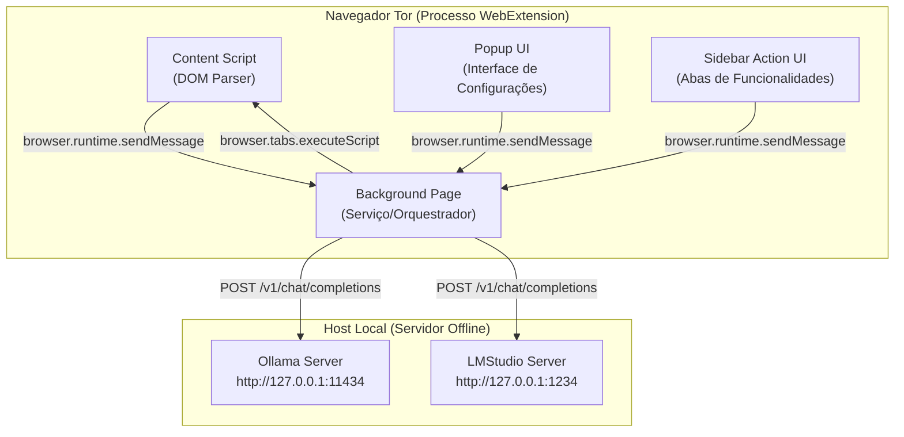

# 🏛️ Relatório de Arquitetura do Sistema — TorAI

Este documento descreve a arquitetura interna da extensão **TorAI**, detalhando o fluxo de dados, a comunicação entre processos e a estruturação de componentes.

---

## 1. Visão Geral da Arquitetura

O **TorAI** é projetado como uma WebExtension compatível com o ecossistema do Firefox ESR (utilizado pelo Tor Browser). A arquitetura é dividida em três ambientes de execução isolados, interconectados por APIs seguras de troca de mensagens.

---

## 2. Componentes do Sistema

### 2.1 Content Script (`content-script.ts`)
Executado diretamente no contexto da página web ativa do usuário.
- **Função**: Extrai o conteúdo semântico relevante (título, parágrafos de texto, atributos `alt` de imagens e cabeçalhos) e captura a seleção de cursor atual do usuário.
- **Isolamento**: Não possui acesso a rede ou armazenamento da extensão. Todo dado extraído é repassado ao script em background via `browser.runtime.sendMessage`.

### 2.2 Background Script (`background.ts`, `ai-client.ts`, `prompt-builder.ts`, `security.ts`)
O orquestrador persistente que coordena todo o ciclo de vida da extensão.
- **background.ts**: Gerencia o roteamento de mensagens do painel lateral e do popup, atalhos globais de teclado (ex: `Ctrl+Shift+S`) e o ciclo de limpeza de cache temporário.
- **ai-client.ts**: Cliente HTTP que unifica as chamadas aos backends de IA local usando a API compatível com OpenAI (`/v1/chat/completions`). Gerencia timeouts e retries com backoff exponencial.
- **prompt-builder.ts**: Traduz ações de interface em prompts estruturados em português, injetando regras de anonimato e privacidade estritas.
- **security.ts**: Módulo crítico responsável por certificar que nenhuma requisição a hosts externos seja disparada e que caracteres de injeção de prompt sejam mitigados.

### 2.3 Popup UI (`popup.html`, `popup.ts`, `popup.css`)
Interface acionada pelo ícone de extensões no canto superior do navegador.
- **Função**: Controla a parametrização do provedor ativo (Ollama/LMStudio), realiza a auto-detecção dos servidores locais, lista modelos disponíveis dinamicamente e gerencia sliders de temperatura e limites de geração.

### 2.4 Sidebar UI (`sidebar.html`, `sidebar.ts`, `sidebar.css`)
Painel lateral ancorado no navegador, permitindo a interação constante enquanto o usuário navega.
- **Abas Funcionais**:
  1. **Resumo**: Geração de resumos curtos (2-3 frases) ou detalhados (5-8 frases).
  2. **Tradução**: Conversão multilíngue preservando formatação essencial.
  3. **Dicas**: Auditoria offline de legibilidade e boas práticas.
  4. **Entidades**: Identificação rápida de datas, autores, links e tags estruturadas.
  5. **Trecho**: Análise sob demanda de seleções parciais de texto.

---

## 3. Protocolo de Comunicação de Mensagens

A comunicação entre a interface (Popup/Sidebar) e o Background utiliza o modelo de requisição e resposta JSON estruturado em [messages.ts](file:///c:/Users/renan/Desktop/Extencao%20Tor/tor-ai-extension/src/shared/messages.ts):

| Mensagem `action` | Origem | Destino | Descrição |
|---|---|---|---|
| `GET_SETTINGS` | Popup/Sidebar | Background | Retorna configurações atuais do storage. |
| `SAVE_SETTINGS` | Popup | Background | Atualiza as configurações e valida os campos. |
| `DETECT_PROVIDERS` | Popup | Background | Executa ping em `127.0.0.1` nas portas `11434` e `1234`. |
| `GET_MODELS` | Popup | Background | Retorna modelos carregados no Ollama/LMStudio. |
| `RUN_TASK` | Sidebar | Background | Inicia fluxo de extração de texto e chamada de IA. |
| `CANCEL_TASK` | Sidebar | Background | Aborta a chamada atual usando `AbortController`. |
